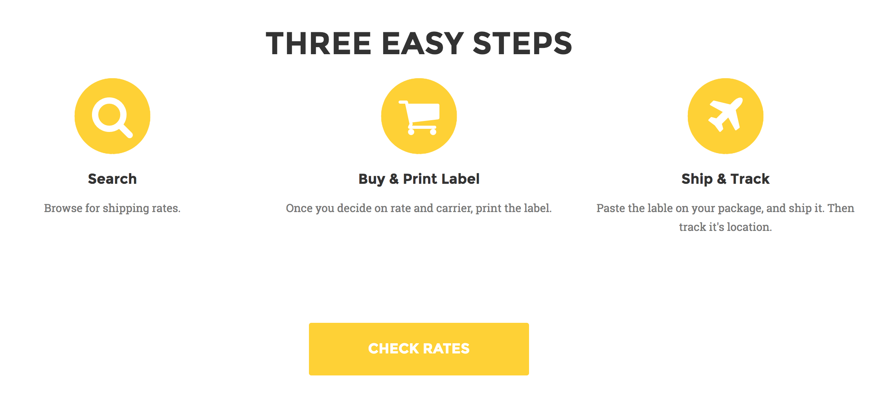
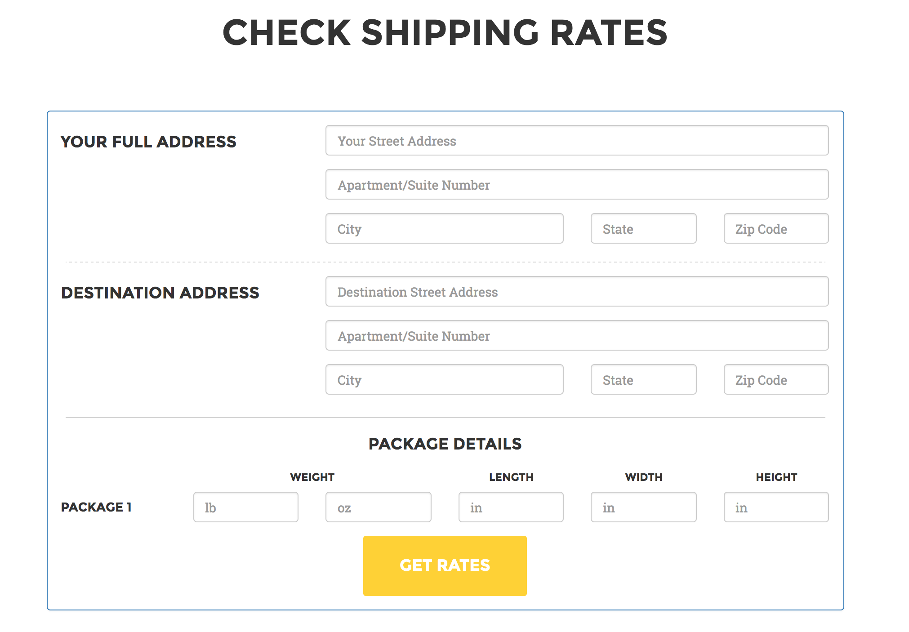

#Shiplify-Simplyfying Shipping 

Shiplify is a go to place to get best prices for shipping labels. We have created an easy online platform to compare shipping rates from different carriers in one place, without having to create separate accounts on different websites.

## Screenshots

## Technologies used
You can give a brief listing of the technologies you've learned and applied here
- HTML
- CSS/Bootstrap
- Javascript/Jquery
- Ajax
- node.js
- Express
- Firebase

## Getting Started
To get a copy for testing purpose, please download repo as zip.

## Built With
* Agency - Template of choice from Start Bootstrap
* Google Places API
* Google Geotag API
* Easypost API 

## Current Functionality
Currently Shiplify only provides shipping rate for standard shipping. You can only check rates.

## Plans for Future Functionality
In future, we plan to add feature like buy shipping labels, and track shipments.

## Contributors
*Azim Momin
*Faras Momin
*Kashan Ali Qazi

## Acknowledgments
Special thanks to all the instructors and TA of Coding Bootcamp in Houston.

